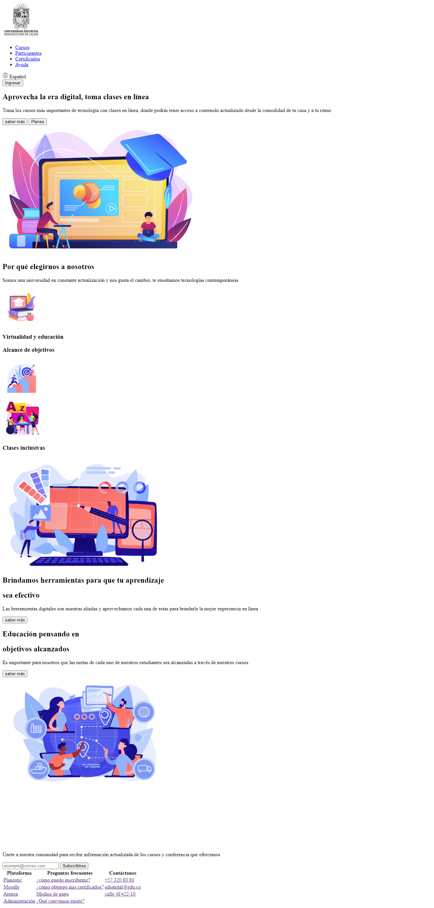

<h1> taller 9 - Martha Isabel Reyes Cruz </h1>

<h2>Infomrmación</h2>

Curso: Full Stack Básico - Grupo 1 

Profesor: Crisitan Patiño 

<h2>Link de la página Web</h2>

<h2>Punto 1: Link de Figma</h2>
<a href="https://www.figma.com/file/byixUXuWMYBHhRNmwTBWLN/Martha-Isabel-Reyes-Cruz?type=design&node-id=8%3A256&mode=design&t=4hJePcIC87addaiT-1">Link de Figma</a>

<h2> Punto 2: Diseño en HTML </h2>

<h2> punto 3: Diseño con CSS</h2>

<h2> punto 4:Títulos </h2>

<h2> punto 5: Párrafo  </h2>

<h2> punto 6: Links  </h2>

<h2> punto 7 y 8: Navegación</h2>

<h2> punto  9: Tabla</h2>